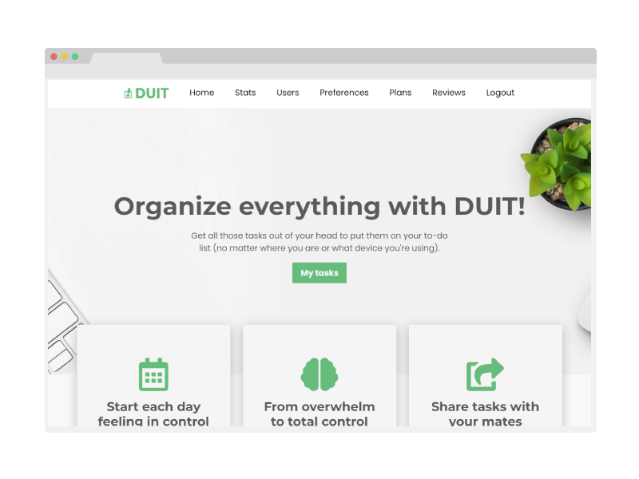

<div id="top"></div>

<!-- PROJECT LOGO -->
<br />
<div align="center">
  <a href="https://github.com/lopezrunco/ToDo-App-API-MongoDB">
    
  </a>

<h3 align="center">Duit ToDo-App-API-MongoDB</h3>

  <p align="center">
    Demo of a task manger app (MongoDB, Express, React & Node)
  </p>
</div>


<!-- TABLE OF CONTENTS -->
<details>
  <summary>Table of Contents</summary>
  <ol>
    <li>
      <a href="#about-the-project">About The Project</a>
      <ul>
        <li><a href="#built-with">Built With</a></li>
      </ul>
    </li>
    <li>
      <a href="#getting-started">Getting Started</a>
      <ul>
        <li><a href="#prerequisites">Prerequisites</a></li>
        <li><a href="#installation">Installation</a></li>
      </ul>
    </li>
    <li><a href="#contributing">Contributing</a></li>
  </ol>
</details>


<!-- ABOUT THE PROJECT -->
## About The Project



This was the first project of my Full Stack career. In this project I learned the basics of React, Node, MongoDB and Express. I combined this with my previous skills in SASS and responsive web design to give a good-looking to the app.

<p align="right">(<a href="#top">back to top</a>)</p>


### Built With


<p align="right">(<a href="#top">back to top</a>)</p>


<!-- GETTING STARTED -->
## Getting Started

### Prerequisites

* node.js
* npm

### Installation

1. Clone the repo
   ```sh
    git clone https://github.com/lopezrunco/ToDo-App-API-MongoDB.git
   ```
2. Install NPM packages
   ```sh
    npm i
   ```
3. Create .env file with environment variables.
   ```
    PORT=3000
    JWT_KEY=super_secret_key
    DB_HOST=localhost
    DB_PORT=3306
    DB_NAME=todos
    DB_USER=root
    DB_PASSWORD=root
   ```
4. Insert demo data
   ```sh
    npm run seed
   ```
5. Run API
    ```sh
    npm run dev
    ```
6. Run unitary tests
    ```sh
    npm run test
    ```
7. Run unitary tests and generate coverage report
    ```sh
    npm run test:coverage
    ```

Debugging:

The project is configured to use Visual Studio Code as debugging tool.
More info: https://code.visualstudio.com/docs/nodejs/nodejs-debugging

<p align="right">(<a href="#top">back to top</a>)</p>


<!-- CONTRIBUTING -->
## Contributing

Contributions are what make the open source community such an amazing place to learn, inspire, and create. Any contributions you make are **greatly appreciated**.

If you have a suggestion that would make this better, please fork the repo and create a pull request. You can also simply open an issue with the tag "enhancement".
Don't forget to give the project a star! Thanks again!

1. Fork the Project
2. Create your Feature Branch (`git checkout -b feature/AmazingFeature`)
3. Commit your Changes (`git commit -m 'Add some AmazingFeature'`)
4. Push to the Branch (`git push origin feature/AmazingFeature`)
5. Open a Pull Request

<p align="right">(<a href="#top">back to top</a>)</p>


